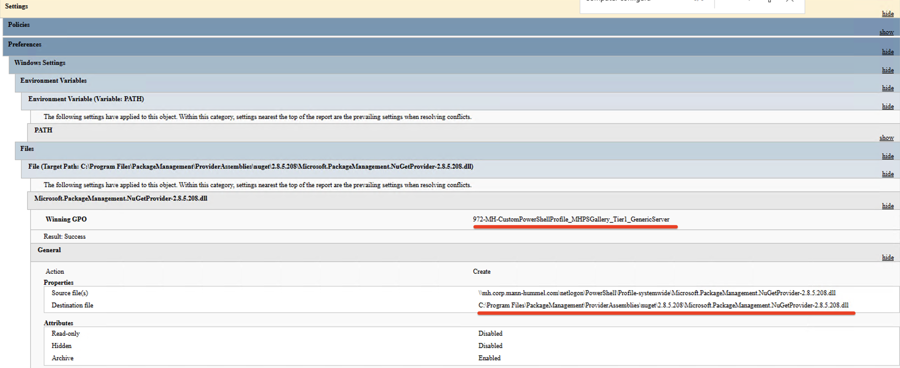
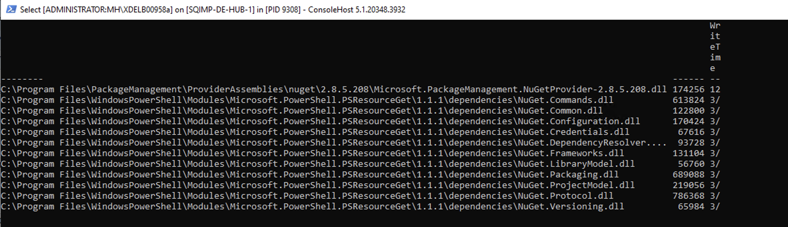
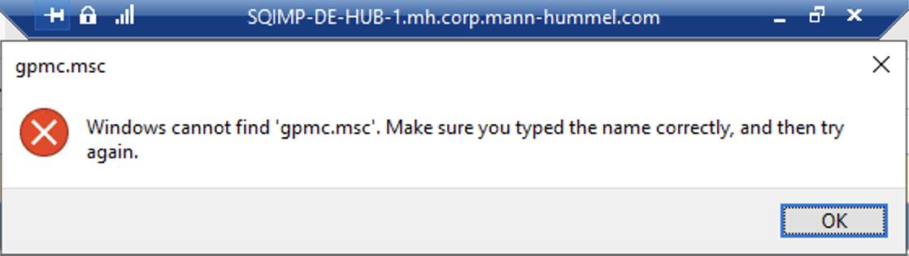
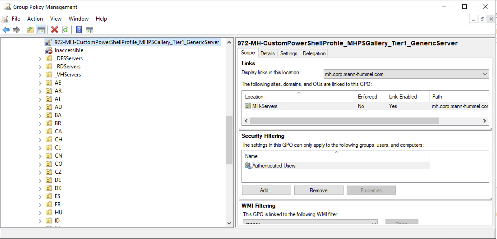
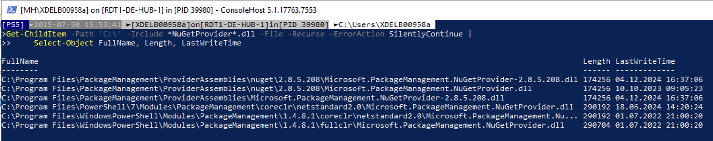
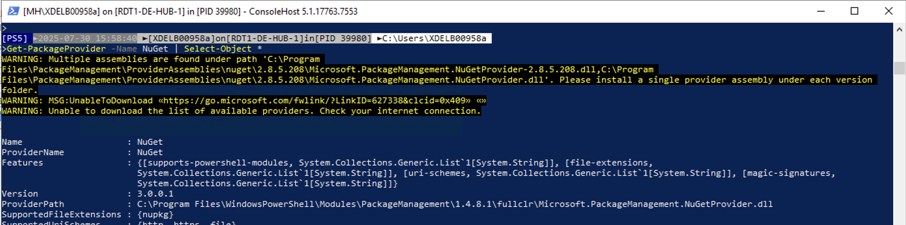

# **SQIM** 

**- Gpresult result:**
```powershell
gpresult /h C:\Temp\gpresult.html /f
```

- The GPO is: **972-MH-CustomPowerShellProfile_MHPSGallery_Tier1_GenericServer**


**- I only found one .dll:**<br>

```powershell
Get-ChildItem -Path 'C:\' -Include *NuGet*.dll -File -Recurse -ErrorAction SilentlyContinue |
    Select-Object FullName, Length, LastWriteTime
 ```   


**- I can't enter to the gpmc.msc:**<br>


<br><br>


# **RDT1** 

**- I can enter to gpmc.msc to identified the GPO (972-MH-CustomPowerShellProfile_MHPSGallery_Tier1_GenericServer):**<br>


**- I only found 6 .dll:**<br>

```powershell
Get-ChildItem -Path 'C:\' -Include *NuGet*.dll -File -Recurse -ErrorAction SilentlyContinue |
    Select-Object FullName, Length, LastWriteTime
 ```
   


**- To check the real path where Powershell reads the .dll:**

```Powershell
Get-PackageProvider -Name NuGet | Select-Object *
```

- The full path is: **C:\Program Files\WindowsPowerShell\Modules\PackageManagement\1.4.8.1\fullclr\Microsoft.PackageManagement.NuGetProvider.dll**



Te lo escribo porque en audio sólo me permite enviar 1 minuto y necesito más tiempo........


Ejecurté el gpresult sobre SQIMP y obtuve la GPO que había que editar (972-MH-CustomPowerShellProfile_MHPSGallery_Tier1_GenericServer), pero en SQIM no puedo abrir el Group Policy Management:

image


Entonces para editar la GPO fui a RDT1 en donde si puedo abrir el Group Policy Management, le coloqué las variables %DomainName% y %ProgramFiles en las rutas, en el File que crea la copia del .dll:


image


Y además creé el File para borrar el .Dll que no debería de estar:

image


Creé 2 porque había otro en otra ruta:

image


Y todo bien con la configuración pero cuando le hago seguimiento y consulto el Event Viewer de SQIMP, hay una advertencia que dice que no se ha aplicado la política por 'Group Policy Object did not apply because it failed with error code 'Ox80070005 Access is denied.'':

image


Además tambié consulté el Event Viewer de RDT1,  hay una advertencia que dice que no se ha aplicado la política por 'Acces denied' también:

image


Entonces quería que me enseñaras a cómo verificar que una GPO está bien configurada o qué permisos debe de tener para que  funcione correctamente y además a hacerle seguimiento a esta tarea
