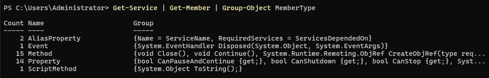

|Módulo	|Cmdlet / Comando	|Descripción
|---------------|---------------|---------------|
|Básico	|Get-Help	|Muestra ayuda sobre cmdlets y conceptos
|Básico	|Get-Command	|Lista cmdlets y comandos disponibles
|Básico	|Get-Service	|Consulta estado de servicios Windows
|Básico	|Restart-Service	|Reinicia un servicio Windows
|Básico	|Get-Process	|Lista procesos activos
|Básico	|Stop-Process	|Detiene un proceso por nombre o ID
|Básico	|Start-Process	|Inicia un proceso o ejecutable
|Básico	|Get-ChildItem	|Lista archivos y carpetas (equivale a dir/ls)
|Básico	|Copy-Item	|Copia archivos o carpetas
|Básico	|Remove-Item	|Elimina archivos o carpetas
|Básico	|Set-ExecutionPolicy	|Cambia política de ejecución para scripts
|Básico	|Get-EventLog	|Consulta registros de eventos (logs)
|Básico	|Get-Member	|Explora propiedades y métodos de objetos
|Básico	|Invoke-Command	|Ejecuta comandos en equipos remotos
|Básico	|Enter-PSSession	|Abre sesión interactiva remota
|ActiveDirectory	|Get-ADUser	|Lista usuarios en AD (requiere |módulo ActiveDirectory)
|ActiveDirectory	|Get-ADGroup	|Lista grupos en AD
|ActiveDirectory	|Get-ADGroupMember	|Lista miembros de un grupo AD
|ActiveDirectory	|Get-ADComputer	|Lista equipos registrados en AD
|ActiveDirectory	|New-ADUser	|Crea nuevo usuario en AD
|ActiveDirectory	|Set-ADUser	|Modifica atributos de usuarios
|ActiveDirectory	|Enable-ADAccount	|Habilita cuenta de usuario
|ActiveDirectory	|Disable-ADAccount	|Deshabilita cuenta de usuario
|ActiveDirectory	|Unlock-ADAccount	|Desbloquea cuentas bloqueadas
|ActiveDirectory	|Search-ADAccount	|Busca cuentas inactivas, bloqueadas o expiradas
|ActiveDirectory	|Get-ADObject	|Consulta objetos arbitrarios de AD
|Microsoft.Graph / EntraID	|Connect-MgGraph / Connect-Entra	|Conecta a Microsoft Graph / Entra para administrar Entra ID
|Microsoft.Graph / EntraID	|Get-MgUser / Get-EntraUser	|Obtiene usuarios de Microsoft Entra ID
|Microsoft.Graph / EntraID	|New-MgUser / New-EntraUser	|Crea usuario en Microsoft Entra ID
|Microsoft.Graph / EntraID	|Set-MgUser / Set-EntraUser	|Modifica usuario en Entra ID
|Microsoft.Graph / EntraID	|Remove-MgUser / Remove-EntraUser	|Elimina usuario en Entra ID
|Microsoft.Graph / EntraID	|Get-MgGroup / Get-EntraGroup	|Obtiene grupos en Entra ID
|Microsoft.Graph / EntraID	|New-MgGroup / New-EntraGroup	|Crea grupo en Entra ID
|Microsoft.Graph / EntraID	|Set-MgGroup / Set-EntraGroup	|Modifica grupo en Entra ID
|Microsoft.Graph / EntraID	|Remove-MgGroup / Remove-EntraGroup	|Elimina grupos en Entra ID

<br>
<br>

# Operadores Lógicos y de Comparación en PowerShell

| **Operador**   | **Tipo**         | **Descripción**                                                                                  | **Ejemplo**                                    |
|----------------|------------------|--------------------------------------------------------------------------------------------------|------------------------------------------------|
| `-and`         | Lógico           | Devuelve **True** si las dos condiciones son verdaderas.                                         | `($a -gt 5) -and ($b -lt 10)`                  |
| `-or`          | Lógico           | Devuelve **True** si al menos una de las condiciones es verdadera.                              | `($a -gt 5) -or ($b -lt 10)`                   |
| `-xor`         | Lógico           | Devuelve **True** si solo una de las condiciones es verdadera (exclusivo).                      | `($a -gt 5) -xor ($b -lt 10)`                  |
| `-not` o `!`   | Lógico           | Invierte el valor lógico (**True** ↔ **False**).                                                 | `-not ($a -gt 5)` / `!($a -gt 5)`              |
| `-eq`          | Comparación      | Igual a (equal).                                                                                 | `$a -eq 5`                                     |
| `-ne`          | Comparación      | No igual a (not equal).                                                                          | `$a -ne 5`                                     |
| `-gt`          | Comparación      | Mayor que (greater than).                                                                        | `$a -gt 5`                                     |
| `-ge`          | Comparación      | Mayor o igual que (greater or equal).                                                            | `$a -ge 5`                                     |
| `-lt`          | Comparación      | Menor que (less than).                                                                           | `$a -lt 5`                                     |
| `-le`          | Comparación      | Menor o igual que (less or equal).                                                               | `$a -le 5`                                     |
| `-like`        | Patrón (wildcard)| Compara con comodines `*` y `?` (no es regex).                                                   | `"server01" -like "server*"`                   |
| `-notlike`     | Patrón (wildcard)| Negación de `-like`.                                                                             | `"server01" -notlike "db*"`                    |
| `-match`       | Expresión regular| Evalúa si el valor coincide con una expresión regular.                                           | `"abc123" -match "\d{3}"`                      |
| `-notmatch`    | Expresión regular| Negación de `-match`.                                                                            | `"abc" -notmatch "\d"`                         |
| `-contains`    | Contenedor       | Comprueba si una colección contiene un valor específico (lado izquierdo **colección**).         | `@(1,2,3) -contains 2`                         |
| `-notcontains` | Contenedor       | Negación de `-contains`.                                                                         | `@(1,2,3) -notcontains 5`                      |
| `-in`          | Contenedor       | Comprueba si un valor está dentro de una colección (lado izquierdo **valor**).                   | `2 -in @(1,2,3)`                               |
| `-notin`       | Contenedor       | Negación de `-in`.                                                                               | `5 -notin @(1,2,3)`                            |
| `-is`          | Tipo de datos    | Comprueba si un objeto es de un tipo especificado.                                               | `"text" -is [string]`                          |
| `-isnot`       | Tipo de datos    | Negación de `-is`.                                                                               | `"text" -isnot [int]` 

## **Some Querys:**

***- Get all properties and methods from the selected cmdlet (Get-Service):***<br>
```powershell
Get-Service | Get-Member
```

***- Groups the methods and properties (members) of the Get-Service cmdlet by member type:***<br>
```powershell
Get-Service | Get-Member | Group-Object MemberType
```


***- Way #1 to filter all the members (Methods and properties) with MemberType='Method':***<br>
```powershell
Get-Service | Get-Member -MemberType Method
```

***- Way #2 to filter all the members (Methods and properties) with MemberType='Method':***<br>
```powershell
Get-Service | Get-Member -MemberType Method
```

***- Get all properties and methods from the selected Service (Wseacrh):***<br>
```powershell
Get-Service Wsearch | Get-Member
```

***- Show all metadatos from the selected cmdlet:***
```powershell
Get-Command Get-Process | Format-List *
```

***- Groups all services with status 'Running':***
```powershell
Get-Service | Where-Object {$_.Status -eq "Running"} | Group-Object Status
```

***- More than one filter apply in the same 'pipe':***
```powershell
Get-Service | Where-Object {$_.Status -eq "Running"} | Where-Object {$_.DisplayName -like "*Active*"}
```


